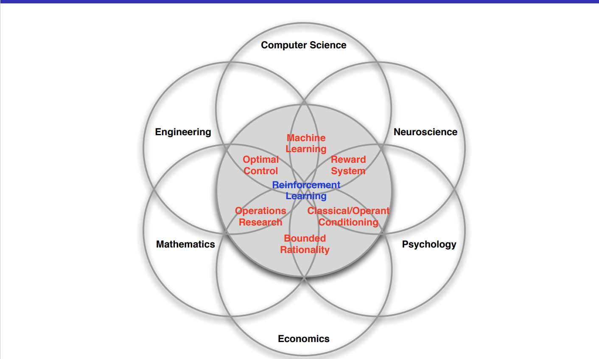

# Introduction
RL can be defined as the science of decision-making, and how to make the best sequence of decisions, this makes RL intersection between different fields (optimal control, economics, neuroscience, etc..)

## What makes RL different from other Machine Learning Paradigms?
the major difference between RL and other paradigms is 
- there is no supervision but direct rewards signal from the environment.
- Feedback is delayed with respect to time, not instantaneous
- Time matters, having an early reward is not equivalent to late rewards.
  

## Applications 

-Flying Helicopter  
-Defeating the world champion in the go game.  
-Investment portfolio.  
-Power Plant Control.   

## RL Problem and Definitions 
Reinforcement learning relies on the assumption that any goal can be achieved by increasing the cumulative reward, and the agent's role will be to maximize the cumulative reward.
for example, an agent controlling a power plant will receive a positive reward for generating power and a negative reward for exceeding the safety threshold.

in summary, we can say that the agent will be **receiving observation and reward** from the environment but producing **actions** at **every time step**. 

**History** can be defined as a sequence of actions, observations, and rewards, our goal given the history is to build a mapping algorithm between the History and Actions. 
**State** is defined as the information used to determine what to do next, we can say that state is a function of history. 

# Lecture 3 
The RL is associated with Dynamic Programming, by Dynamic the lecturer means something sequential or have temporal aspect and by programming we don't mean c programming but mathmatical programming which can be understood as optimising, if you can recall something called linear programming.  

at it's heart dynamic programming is a techiniques to solve complex problems by breaking them into smaller problems and eventually solve the subproblems and combining those solutions to form a solution for the complex problem.

**Dynamic Programming** is a very general solution for a problem that has 2 main proprties.
- optimal substructure (subproblems reccur many times).
- overlapping subproblems (Solutions can be cashed and reused).

Markov Decision process satisfy both proprties, 
- Bellman equation gives the recursive decomposition.
- Value function stores and reeuse the solution.

Dynamic programming assumes full knowledge of MDP which is not true in case of (RL) but it can be used for Planning in a MDP.

the input for the problem will be the whole MDP including (S,A,P,R,Gamma) and the output will be the value function.

dynamic programming is used to solve different problems such as: 
-Scheduling Algorithm 
-String Algorithm ()
-Graph Algorithm ()

## Policy Evaluation 
in this problem we would like to evaluate a specific police (pi), to solve this problem we will be iterating over the bellman equation.
we start with arbitrary value V1 and iterate over it to reach (Vpi)  
V1 -> V2 -> ... -> V(Pi).  
at every iteration we will sweep over all different states and update them, eventually the value function will convertge to V(Pi)

